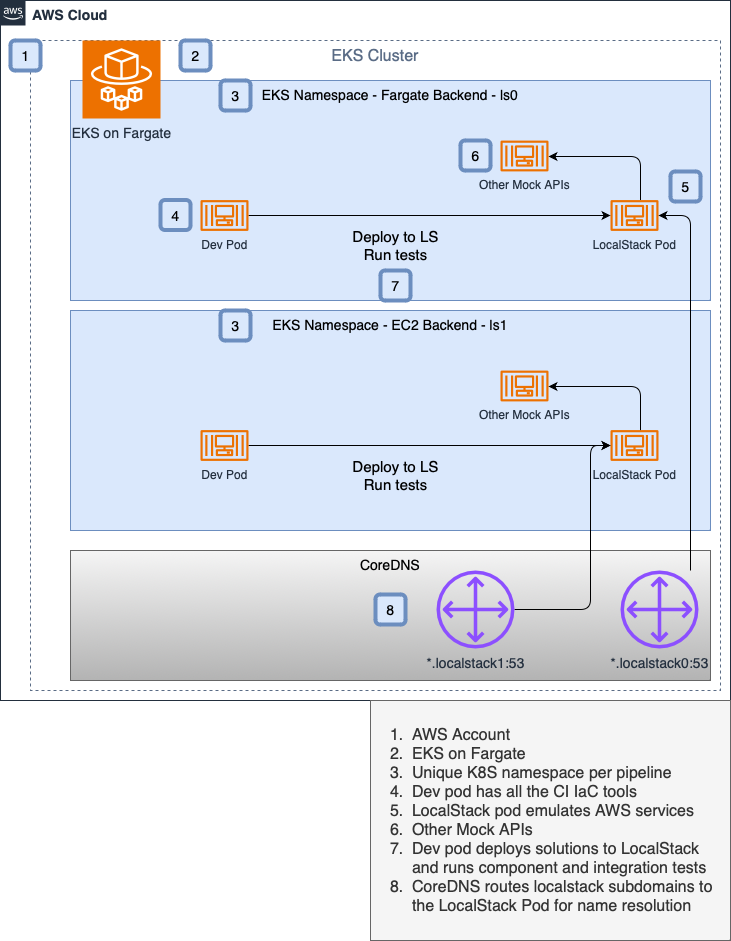
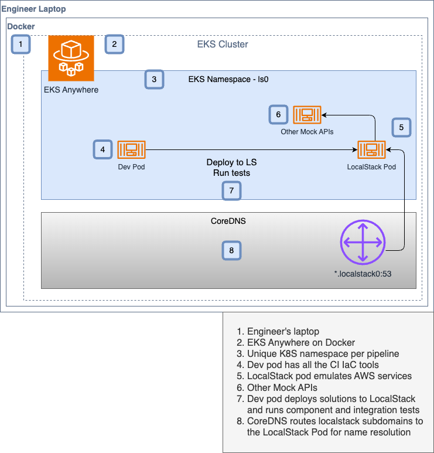

# 🌐 Overview

This blueprint has two solutions:

1. Deploy LocalStack to AWS EKS with Fargate. 
2. Deploy LocalStack on an engineer's laptop on EKS Anywhere with Docker.

[**Solution-1**](#solution-1) provides a hybrid integration environment where teams can run component/integration/system tests.
The solution is managed in AWS to allow for easy management of the entire platform across multiple AWS accounts.

[**Solution-2**](#solution-2) is identical to Solution-1 but it runs on engineers laptops with EKS Anywhere. 

The two solutions having nearly identical tooling allows enterprise teams to create a manageable
solution testing platform.

### LocalStack on AWS EKS Fargate
Multiple namespaces isolate testing of different solutions.


### LocalStack on Engineer's Laptop with EKS Anywhere


### 🔑 Key Components

- **LocalStack on K8S**
    LocalStack provides AWS Service emulation to create aan amazing DevX with powerful solution testing. 
- **Dev Container**
    Provides standard tooling to build, deploy, and test solutions. 
- **Amazon Elastic Kubernetes Service**
    K8S common platform for DevSecOps tooling to support unit, component, and integration testing.

## Getting Started 🏁

This guide assumes that you have cloned this repository and are in the project root directory. The following steps will
guide you through the process of building, deploying, and test Solution-1 (Solution-2 link).
Solution-1 is not free. It will cost money to run EKS in AWS. Make sure to destroy your resources in the cleanup
section to control your costs.

### Solution-1

This solution has the EKS cluster deployed on AWS.

#### Prerequisites for Solution-1 🧰

- [install Helm](https://helm.sh/docs/intro/install/)
- [install kubectl](https://kubernetes.io/docs/tasks/tools/)
- [install eksctl](https://eksctl.io/installation/)
- AWS credentials for `eksctl`.
- `export LOCALSTACK_AUTH_TOKEN=<your LocalStack auth token>` added to `.env-local`.

#### Solution-1 Steps

Let's create the AWS cluster. This blueprint builds namespaces in the format of `ls<NS_NUM>`. So, we're going
to choose a namespace number for the following targets.

```shell
make aws-setup-cluster

# Create the namespace and the Fargate profile.
make aws-bootstrap NS_NUM=0
# Apply CoreDNS patch so that CoreDNS points to the Localstack service.
make patch-coredns NS_NUM=0

# Generate manifests and apply Localstack/DevPod deployments.
make deploy-setup NS_NUM=0
make deploy-localstack NS_NUM=0

# Exec into dev environment
make exec-devpod-interactive NS_NUM=0
```

Once inside the DevPod environment, let's clone our Localstack sample project:

```shell
git clone https://github.com/localstack-samples/lambda-ddb.git
cd lambda-ddb

make integ-awscdk-bootstrap
make integ-awscdk-deploy
make integ-awscdk-test
```

After the test passes, let's cleanup the EKS cluster:

```shell
make aws-deploy-cleanup NS_NUM=0
make aws-cleanup-cluster
```

### Solution-2

This solution has the EKS cluster deployed on your local machine, using the EKS anywhere plugin.

#### Prerequisites for Solution-2 🧰

- Locally-accessible machine.
- [install Helm](https://helm.sh/docs/intro/install/)
- [install kubectl](https://kubernetes.io/docs/tasks/tools/)
- [install eksctl](https://eksctl.io/installation/)
- [install eksanywhere plugin](https://anywhere.eks.amazonaws.com/docs/getting-started/install/)

#### Solution-2 Steps

Let's create the AWS cluster using EKS Anywhere locally. This blueprint builds namespaces in the format of `ls<NS_NUM>`. So, we're going to choose a namespace number for the following targets.

```shell
make local-setup-cluster

# Create the namespace.
make local-bootstrap NS_NUM=0
# Apply CoreDNS patch so that CoreDNS points to the Localstack service.
make patch-coredns NS_NUM=0

# Generate manifests and apply Localstack/DevPod deployments.
make deploy-setup NS_NUM=0
make deploy-localstack NS_NUM=0

# Exec into dev environment
make exec-devpod-interactive NS_NUM=0
```

Once inside the DevPod environment, let's clone our Localstack sample project:

```shell
git clone https://github.com/localstack-samples/lambda-ddb.git
cd lambda-ddb

make integ-awscdk-bootstrap
make integ-awscdk-deploy
make integ-awscdk-test
```

After the test passes, let's cleanup the EKS cluster:

```shell
make local-deploy-cleanup NS_NUM=0
make local-cleanup-cluster
```

##### A 2nd deployment

To setup a second namespace and test in it, simply do this.
We'll use namespace number 1 (we've already used namespace number 0).
The cluster already exists so we'll just add another namespace to it,
deploy LocalStack and the DevPod, login to the DevPod, and test a repo.

```shell
make local-bootstrap NS_NUM=1
make patch-coredns NS_NUM=1
make deploy-setup NS_NUM=1
make deploy-localstack NS_NUM=1
make exec-devpod-interactive NS_NUM=1

git clone https://github.com/localstack-samples/lambda-ddb.git
cd lambda-ddb
make integ-awscdk-bootstrap
make integ-awscdk-deploy
make integ-awscdk-test
```

**Cleanup Namespace 2**

```shell
make deploy-cleanup NS_NUM=1
```

### Multiple Namespaces

To deploy multiple Localstack instances with their own dev environment, you can do something like this:

```shell

function create_environment () {
    local namespace_idx="$1"
    make local-bootstrap NS_NUM=$namespace_idx
    make patch-coredns NS_NUM=$namespace_idx
    make deploy-setup NS_NUM=$namespace_idx
    make deploy-localstack NS_NUM=$namespace_idx
    make exec-devpod-interactive NS_NUM=$namespace_idx
}

function check_localstack () {
    local namespace_idx="$1"
    make exec-devpod-noninteractive NS_NUM=$namespace_idx CMD="curl -i localstack$namespace_idx:4566"
}

# Create a 100 environments
for i in `seq 0 100`; do
    create_environment "$i"
done

# Execute the `ls -la` command on all 1000
for i in `seq 0 100`; do
    check_localstack "$i"
done
```
